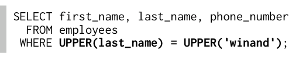
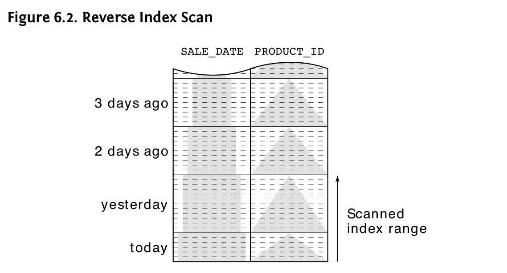
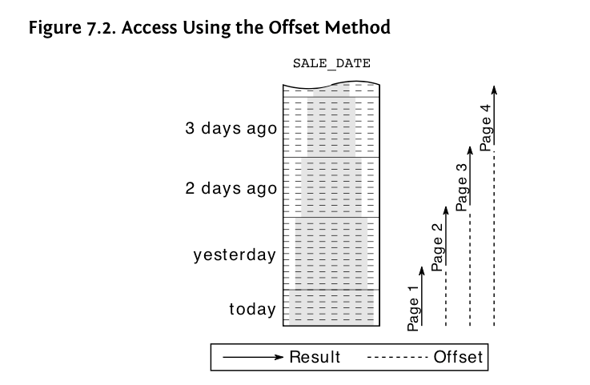

_(this books requires basic understanding of index)_

# 1: Anatomy of index

1. Purpose of the index is to represent data in an ordered manner.

2. A database index is, after all, very much like the index at the end of a book:

    - it occupies its own space,
    - it is highly redundant,
    - it stores index key and reference to the actual data stored in a different place.

3. Index files’ size are much smaller compared to the size of referred data; yet, _storing index files sequentially in a hard disk is impossible_. Because if we store data sequentially, each time doing WRITE, UPDATE, DELETE operation might need to moving the whole index file around

    => Instead, db store index file in the format of B (Balanced) tree. Leaf nodes are connected toghether by doubly linked list.

## Key concepts

**B tree**


-   A structure that helps databases to find leaf-nodes easily.
-   Each branch node points to the highest key value in leaf-node
-   To reach a leaf-node, only need to travel upto O(depth of the tree). If we don't have this structure, we have to take O(length of node-leafs) to find a leafnode based on DLL.
-   Modifying table data may cause overhead of maintenance of B-trees.

**Index leaves nodes**


-   About each leaf node, index rows are stored sequentially in database block (or page) - smallest storage unit in database == multiple of OS block size.

-   Each leaf node is _stored randomly_ in hard disk but they are _connected logically_ to each other by using a _doubly linked list (DLL)_. This creates logical order between each leaf node without caring about its physical location.
-   Unlike leaf node, table (real data), which is divided into smaller blocks, are stored randomly in a heap structure. In each block, however, data is store contiguously.

**_Slow indexes_**

Actually, an index looks up requires 3 steps:

1. Tree traversal

    Travel from root to leaf until meet the desired key

2. Following leaf node chain

    There might be multiple records that have the same desired key. We have to look through all the records to find out the correct one, by following the Linked list chain.

3. Accessing table data

-   When hitting the index row having the desired key, we have to access the table data (the real one). This requires an additional hard disk access time.
-   In case of having to follow leaf node chains, multiple hard disk access will be needed.
    The real data rows can be scattered at different data blocks. This makes the access time even longer.

In these above operation, only the first one has upper bound (O(depth))
The other 2 are the reason causing slow indexes to look up. The total cost is calculated as the total no. of blocks need to be loaded from the disk.

# 2. The where clause

**Important terms**
Inside _predicate information_, get in the _execution plan_, there are 2 types of info, got from the `WHERE` clause:

-   **access predicate**: is the range during index scan, which is the range that we will fetch data from the table
-   **filter predicate**: is used to filter out to get needed data during the leaf node traversal or after getting real data from db

## The equality operator

-   **Primary keys**
    -   _An index auto created for the primary key(s)_
    -   Index of primary keys ensures the uniqueness of each index search key. Therefore, _the slowness of the index will not be presented here._
    -   It uses the command INDEX_UNIQUE_SCAN to look for the required result. (INDEX_RANGE_SCAN can be used in this case if need to deferrable constraint)
-   **Concatenated indexes**

    -   An Index that is created on multiple columns. The order of each columns needed to be chosen carefully (as it is the priority order that how the index is sorted)
    -   Rows with high _'selectivity'_ and highly queried are prioritized to put in front
    -   FULL_TABLE_SCAN sometimes can be more efficient than using index, as it uses multi block read while indexing reads one block after another. Moreover, loading index blocks is an overhead if the cardinality of the index search key is high.

    I.e:

    SELECT student FROM students WHERE student_ID = 20
    there are 1 million students at the table. Student ID = 20 is 80% of that. So full table scan might be a better solution over indexing range scan

-   **Query optimizer**
    There are 2 types:

    -   **Cost-based optimizer**: generate many execution plans and estimate their cost (based on statistics) to choose the best one

        Statistics of tables, columns, and indexes are collected:

        -   The distribution (mostly columns wise) of each value in the table. (selectivity and cardinality of each value)
        -   For table: The size of table (in rows and blocks)
        -   For indexes: The depth of tree and # of leaf nodes

        A proper statistics will lead to better performance. Hence, if statistics is missing, the optimizer will use default value (medium selectivity), which might be incorrect and lead to the slowness of indexing.

    -   **Rule-based optimizer**: based on hard-coded rule set, which is less flexible and seldom used

## Functions

Function-based index:

-   Case sensitive when searching WHERE clause:

    -   Some db, upper and lower case are totally different.
    -   Solutions:

        -   Use different collation (insensitive case collation)
        -   Use UPPER/ LOWER function

    

-   Function-based index (FBI):

    -   DB doesn’t recognise the relation between FUNC( params) and params. As a result, if there exists an index of params, DB will not use it for FUNC(params) queries.

        

        (original query (L) vs interpreted by DB (R))

        The solution to this is to create an index on FUNC (params), so called Function based index.

-   Function used to create index must be deterministic. It means that with the same params the FUNCTION should return the same result at all times.

-   Statistics of the FBI are also kept on table-level as a virtual column. Yet, some DBs, such as Oracle, dont update it automatically when the FBI is created. So, it is recommended that we update manually when the FBI is created.

-   Tips to avoid over-indexing
    -   Unify the access path so that one index can be used by several queries.
    -   Always aim to index the original data as that is often the most useful information you can put into an index.

## Parameterized queries

```
    SELECT first_name, last_name
    FROM employees
    WHERE subsidiary_id = ?
```

Pros:

-   _Security_: Prevent SQL injection. As bind parameter does not change the structure of query. It only determines the value at the place holder
-   _Performance_: Query execution plan is the same (cached) for arbitrary value in placeholder (?). The more complex the optimizer and the SQL query become, the more important execution plan caching becomes

**However, ...**

Sometime, _the value inside place holder shall affect to execution plan_. In the case of un-uniform distribution of data, the concrete value is useful to get the optimal execution plan.

**Conclude**

In practice, most of the cases, actual values does not affect the execution plan. Bind parameters is highly recommended in such cases.

## Searching for ranges

### >, <, and between

Mixing queries of range and equality

    ```
    SELECT first_name, last_name, date_of_birth
      FROM employees
      WHERE date_of_birth >= TO_DATE(?, 'YYYY-MM-DD') AND date_of_birth <= TO_DATE(?, 'YYYY-MM-DD') AND subsidiary_id = ?
    ```

**Rules of thumb**: create concatanated index in the order of equality first, then inequal one. As the range query will be much smaller in this case.

Yet, the difference between 2 orders are neligible if `date_of_birth` selectivity is high.

### Like filters

Wild card (%) position affects a lot while using the index. Then,

    - the part before the first wildcard as an *access predicate*
    - the other characters as a *filter predicate.*

_So, avoid LIKE expressions with leading wildcards (e.g., '%TERM')._

```
SELECT first_name, last_name, date_of_birth
    FROM employees
WHERE UPPER(last_name) LIKE 'WIN%D'
```

In case of bind parameter with wild-card, the db assumes there is no leading wild-card. And this might be wrong

### Index merge

One index with multiple columns is better than multiple indexes

## Partial index

```
SELECT message
    FROM messages
WHERE processed = 'N' AND receiver = ?
```

```
CREATE INDEX messages_todo
            ON messages (receiver)
         WHERE processed = 'N'
```

whenever in where clause has constant value, we can create partial index based on that constant.

**Despite of insignificant improvement on query speed, yet we save tons of space on disk and maintainance index time**

## NULL value

In SQL standard, NULL is NOT a value, but rather a placeholder for missing/ unknown value

### Indexing with NULL

In some DB, index only contains rows value iff the _index search key_ has at least one column is non-NULL value.

In this case, index will not be used as the queried value cannot be found in index

```
CREATE INDEX demo_null
            ON employees (date_of_birth);
```

```
SELECT first_name, last_name
    FROM employees
WHERE date_of_birth IS NULL;
```

**TIPS**: to make NULL value appear in index files. We can either:

-   add another column whose value cannot be NULL (NOT NULL constraint)
-   add another column whose value is CONST
    I.e:

    ```
    CREATE INDEX demo_null
                ON employees (subsidiary_id, date_of_birth);

    or

    CREATE INDEX emp_dob ON employees (date_of_birth, '1');
    ```

### NOT NULL constraint

There is no way to tag a Function in SQL as NOT NULL. Hence, it will assume a Function to be nullable and not use index for the function.

_Work around_ way: mark Function as a virtual column and mark it as NOT NULL

## Obfuscated conditions

_Obfuscated conditions are where clauses that are phrased in a way that prevents proper index usage._

Following this is the anti-pattern we should avoid

A rule of thumb for all the following stuff is that: **_convert search term instead of table columns_**. Otherwise, need to create FBI

```
SELECT ...
    FROM sales
WHERE sale_date = TO_DATE('1970-01-01', 'YYYY-MM-DD')

or

SELECT ...
    FROM ...
WHERE numeric_string = TO_CHAR(42)
```

### Date types

-   Anti-pattern: Apply function on date type to convert it to string
-   Instead, write queries for continuous periods as explicit range condition.
    i.e:
    ` sale_date >= TRUNC(sysdate) AND sale_date < TRUNC(sysdate + INTERVAL '1' DAY)`

### Numeric strings

-   Anti-pattern:: Treat numeric data type as string

### Math

-   Anti-pattern: Put equation in the where clause

```
  SELECT a, b
    FROM table_name
    WHERE 3*a + 5 = b
```

Work-around way, we can convert it smartly and create a FBI

```
  SELECT a, b
    FROM table_name
    WHERE 3*a - b = -5

CREATE INDEX math ON table_name (3*a - b)
```

## 3. Performance & Scalability

Index has great impact when scaling both data volumne and system load (concurrent request)

**Important:** Proper indexing is the best way to reduce query response time—in relational SQL databases as well as in non-relational systems.

Many NoSql systems claim to solve perf problem with _horizontal scaling_. Yet, distributed system also has the issue of high latency as each computer in the system needs to communicate with each other(net-work latency)

## 4. The join operator

There are 3 common join algorithms. One thing that is common to all join algorithms: they process only two tables at a time.

Db try to _pipeline the intermediate results_, which means each row from the intermediate result is immediately pipelined to the next join operation—avoiding the need to store the intermediate result set.

### Nested loop

**Working mechanism:** It works like 2 nested for loops:

-   the outer fetch the results from one table
-   a second query for each row from the outer to fetch the corresponding data from the _other table_.

```
    SELECT employee.ID  FROM table1 WHERE some condition
        SELECT sale.data FROM table 2 WHERE sale.employeeID = employee.ID
        SELECT sale.data FROM table 2 WHERE sale.employeeID = employee.ID
        SELECT sale.data FROM table 2 WHERE sale.employeeID = employee.ID
        ...
```

or in another word

```
    for ele1 in table1:
        for ele2 in table2:
            if ele1.id == ele2.id:
                then select ele2
```

_Creating index for nested loop join is similar for creating index for each SELECT statement above_

**N+1 promblem**
It causes by the ORM. Instead of generating a JOIN query and send to the db to let the DB either choose Nested loop algo or others to execute, the ORM generate each individual SELECT query and send them 1 by 1.

This causes each data of SELECT to take a round-trip. Due to network latency, the performance will be bad.

### Hash join

-   The hash join algorithm aims for the weak spot of the nested loops join: the many B-tree traversals when executing the inner query.
-   Instead it loads the candidate records from one side of the join into a hash table that can be probed very quickly for each row from the other side of the join

```
SELECT *
    FROM sales s
    JOIN employees e ON (s.subsidiary_id = e.subsidiary_id
                    AND s.employee_id = e.employee_id )
    WHERE s.sale_date > trunc(sysdate) - INTERVAL '6' MONTH
```

The query will be executed as:

1.  FULL TABLE ACCESS on employees and stored data on a hash table, which use join predicate as key
2.  FULL TABLE ACCESS on sales and FILTER out the unrelevant date
3.  Then based on each sales' row, quickly probed on hashed table to get the relevant data

To improve the algo:

1. **Create index on independent WHERE clause**

    i.e: `CREATE INDEX sales_date ON sales (sale_date)`

    Then the step number _2_ will be improved, instead INDEX RANGE SCAN will be done. We can even improve more by create index on `employees`

    **Note**: create index on JOIN clause doesnt help anything

2. Minimize the size of hash table.

    - this algo is only optimal if size of hash table fits into RAM
    - 2 tips on reducing the size:

        - Simpler the JOIN condition
        - SELECT fewer/ neccessary columns

        i.e: optimize the above query

        ```
            SELECT s.employee_id, e.subsidiary_id
            FROM sales s
            JOIN employees e ON (s.subsidiary_id = e.subsidiary_id)
            WHERE s.sale_date > trunc(sysdate) - INTERVAL '6' MONTH
        ```

### Sort merge

Similar mechanism to hash merge, **both sides** of the join must be sorted by the join predicates; then they merge toghether like a zipper.

-   If the inputs are already sorted, then sort merge perfoms very well.
-   Yet, in other cases, the hash one is more favourable, espcially when doing on large amout of data.

    Hashing only buffers one side of input as intermediate result; Sort merge needs to sort and store both side.

## 5. Clustering data

**_Second power of indexing_**

_Clustering data means to store consecutively accessed data closely together so that accessing it requires fewer IO operations_

In the following section, we utilized this fact to make use of index more.

### Index filter predicate used intentionally

We can add more columns into an index:

-   If we add a column (i.e: ROWID) that is the key used to sort data in hard disk. Then the index file will be in the closer order of the physical data distribution (Oracle databases automatically do this).

    => this makes table access block more efficient

-   If we add the columns that appear in WHERE clausethe, the filter predicate can be used right at the time of index leaf nodes traversal

    => reduce number of hard-disk accessing time

**Yet**, the bigger the index is, the more complex we need to maintain

i.e:
suppose real data is sorted based on last name

```
SELECT first_name, last_name, subsidiary_id, phone_number
    FROM employees
WHERE subsidiary_id = ?
AND UPPER(last_name) LIKE '%INA%';
```

then an index likes this achieves both above points

`CREATE INDEX empsubupnam ON employees (subsidiary_id, UPPER(last_name));`

### Index-only scan

WHen the index file contains all the mentioned rows in queries, db will not even access the table real data.

This type of index is called **covering index**

```
  CREATE INDEX sales_sub_eur
      ON sales
( subsidiary_id, eur_value );

SELECT SUM(eur_value) FROM sales
   WHERE subsidiary_id = ?;
```

### Index-organized tables (Clustered index)

Normally data in table is stored in a heap structure, which is stored statically whenever db finds a sufficient space to store new data.

Clustered index is B-tree which stored the real-data without the heap table.

**Advantage**:

1. Saves space for the heap structure
2. Every access on the data is index-only scan

**Dis-advantage**:


When creating and using another index, so called **secondary index**, the index leaf nodes donot point to the physical data, but to the logical data.

Because unlike heap structure, data is stored statically, in clustered index table the data is stored dynamically to maintain index structure.

As a result, when look up secondary index, we also need to look up the primary index as well.

You can still use index-only (called secondary index scan) scans to avoid the table access (primary index look up).

**Conclude**

-   Tables with one index only are best implemented as clustered indexes (index-organized tables).
-   Tables with more indexes can often benefit from heap tables.

# 6. Sorting & Grouping

_third power of indexing._

Sorting is very resource extensive (CPU). Moreover, it needs temporary buffer data to store the result. In other word, cannot execute in pipeline manner.

> a fast execution is not the most important aspect of the pipelined execution. It is more important that the **database executes it in a pipelined manner and delivers the first result before reading the entire input**.

Index is sorted by default so we can utilize indexing for executing the following sort related command (in a pipelined manner)

## Order by

If the index file is sorted the same order as in ORDER BY query, then db might not need to call explicit sort anymore


```
SELECT sale_date, product_id, quantity
    FROM sales
WHERE sale_date = TRUNC(sysdate) - INTERVAL '1' DAY ORDER BY product_id;

CREATE INDEX sales_dt_pr ON sales (sale_date, product_id);
```

**Note**: in some cases, if the db still call sort operation explicitly, it might due to 2 reason

    1. The index & GROUP BY sorting order is different
    2. The cost of FULL TABLE ACESS then sort is lower than index look up and table access. So db optimizer might not choose using the former.

## ASC, DESC & NULL first/last

We can specify the sorting option: ascending or descending (and NULL first or last (depends on db)).

DB supports read index in reversed order as well. So, everything is the same as describe above.

```
SELECT sale_date, product_id, quantity
    FROM sales
WHERE sale_date >= TRUNC(sysdate) - INTERVAL '1' DAY ORDER BY sale_date DESC, product_id DESC;
```

this query will still use index. Index is read in reverse order.



**Yet,** db doesnot support reading index in the jumping way. Consider this case:

```
SELECT sale_date, product_id, quantity
    FROM sales
WHERE sale_date >= TRUNC(sysdate) - INTERVAL '1' DAY ORDER BY sale_date ASC, product_id DESC;
```

This one will not, as the reading index happens in jumping way


In some db, it supports specifying custom (ASC/ DESC) order when creating index. In that cases, obviously, we can create such custom index that match the sequence of ORDER BY clause. Then, everything works fine then

`CREATE INDEX sales_dt_pr ON sales (sale_date ASC, product_id DESC)`

## Group by

2 types of grouping algo: - Hashing - sort & group

In general, both algo needs to buffer the intermidiate result. However, we can use index to avoid _sort_ operation with the same condition as ORDER BY

# 7. Partial result

## Querying Top-N rows

```
SELECT *
        FROM sales
ORDER BY sale_date DESC LIMIT 10;
```

**The database can only optimize a query for a partial result if it knows this from the beginning.**

As if fetching the whole table, FULL TABLE ACCESS then explicitly sort will be faster. Yet, if only need 10 first rows, db will try to do in a pipeline manner (Of course, the prerequiste is ORDER BY clause need to be covered by an index as described in section 6).

## Paging through result

_View result page by page._

_It requires a deterministic sort order to get consistent result. As a developer we need to make sure this. By adding more columns to sort order also helps it to be deterministic_

There are 2 methods:

1.  offset method

It select all the data until end of page needed
Then, discard all the already shown page.



Pros:

    -   Easy to implement (especially with databases that have a dedicated keyword for it (offset).)

Cons:

    - the pages drift when inserting new sales because the numbering is always done from scratch. (unstable result)

    - the response time increases when browsing further back.

2.  seek method

    searches the last entry of the previous page and fetches only the rows afterward

    This solves all the above disadvantage. But it is very hard to implement

# 8. Modifying data

_Cost of maintaining index when doing INSERT, UPDATE, DELETE_

**INSERT**

The only command does not benefit from index as it has not WHERE clause

When insert a row, db needs to add that row to ALL indexes (of the altered table) such that make sure that row can be founded in all indexes. The more indexes need to be added, the mover overhead time

**DELETE**

Unlike the insert statement, the delete statement has a where clause that can use all the methods described in Chapter 2

Though it also need to maintain ALL indexes (of the altered table) as well

**UPDATE**

Update also like the 2 above, the only difference is that _it only affects indexes that contains updated columns_
