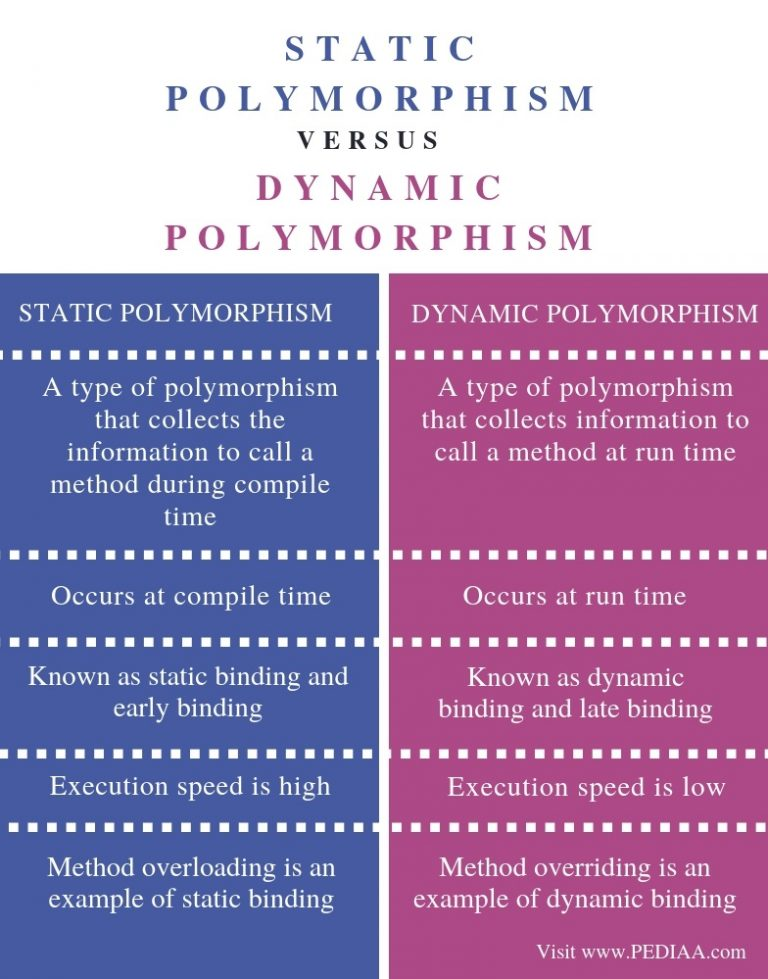

# Encapsulation
- Restrict access to methods & properties in a class, so that provide data hiding and intergrity of objects
- This is helpful in programming side such that programmers can write less-bug code in the future
# Abstraction
- Only provide relevant information for outside world and hide the unnecessary
- This provides better end-user experience
# Inheritance
- A class (sub-class) can inherited all methods and properties of another class (super-class)
# Polymorphism

Means *"many forms"*. Different objects, who have the same type of (abstract) class, can have methods (same name) performing different behaviours



- Static
  - Behaviour is determined at **compile-time**
  - **Overloading-methods** is an example of this type
- Dynamic
  - Behaviour is determined at **run-time**
  - **Overriding-methods** is an example of this type


### Over-loading (happens in the same class)
```
class Calculation {  
  void sum(int a,int b){System.out.println(a+b);}  
  void sum(int a,int b,int c){System.out.println(a+b+c);}  

  public static void main(String args[]) {  
    Calculation obj=new Calculation();  
    obj.sum(10,10,10);  // 30
    obj.sum(20,20);     //40 
  }  
}  
```


### Over-riding (happens in 2 classes)
```
class Animal {    
   public void move(){
      System.out.println("Animals can move");
   }
}

class Dog extends Animal {

   public void move() {
      System.out.println("Dogs can walk and run");
   }
}

public class TestDog {

   public static void main(String args[]) {
      Animal a = new Animal(); // Animal reference and object
      Animal b = new Dog(); // Animal reference but Dog object

      a.move();//output: Animals can move

      b.move();//output:Dogs can walk and run
   }
}
```