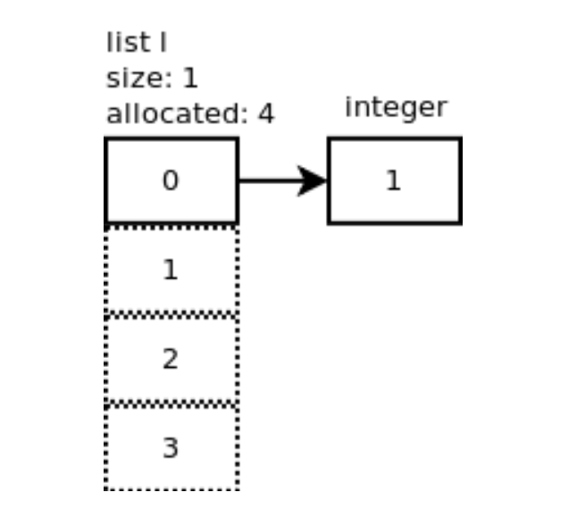
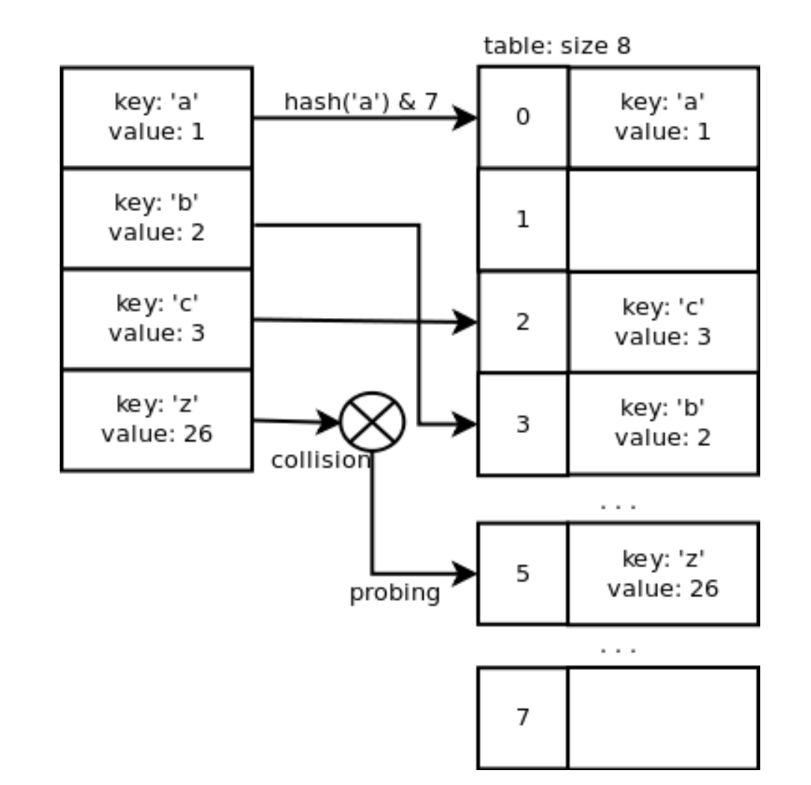
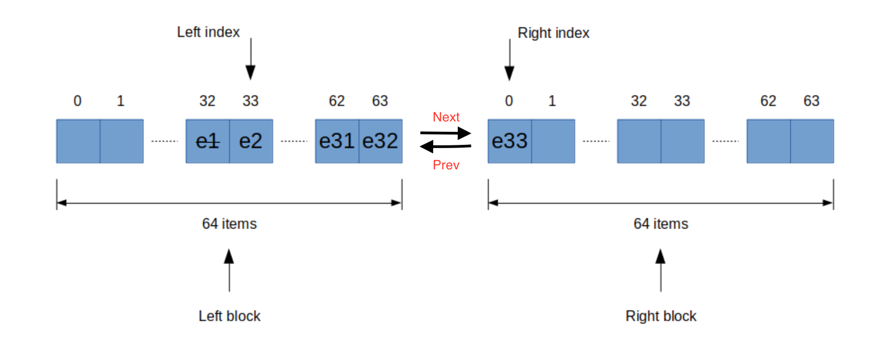

# 1. List



-   Properies:
    -   _Allocated_: # of slots allocated in memory (this # can be smaller than real _size_ of list (len))
    -   Ob_items: Array of pointers to the element
-   Functions:
    -   Init:
        -   allocated = 0
        -   ob_items is empty
    -   Append: O(1) - average
        -   if new_size = size + 1 > Allocated:
            -   resize function() is called -> new list of pointers created (pattern of newly allocated size is designed such that resize func is **rarely called**)
            -   pointers are copied from old to new list
        -   else: (it s straight forward)
    -   Insert/ Delete: O(n)
    -   Pop: O(1)
        -   when size < allocated // 2: ob_items is shrunk

# 2. Dictionary



-   array of pointers point to object of 3 properties: `hash_val`, `key` & `value` pair.
-   Insert:

    -   To determine which slot the element will reside,

        ```
            mask = size_of_hash - 1
            index slot = hash(key) & mask
        ```

    -   The `hash` func is different for each type of key (tuple, integer, string, ...); and its result can be cached.
    -   Whenever the used size >= 2/3 size of hash, a new hash_table with the size of 2 - 4 times of current size. Then, all elements' index will be re-calculated with the new `mask` (`hash(key)` is cached already); then, all elements are copied to the new hash table.
    -   **Collision handling**:
        -   A quadratic probing will be used
        -   Thanks to the mentioned resize mechanism, the collision is also very rare to happen and finding empty slot happens in reasonable time

-   Delete:
    -   Index slot is also calculated as above
    -   Deleted slot will be marked as dummy
    -   Size can be `shrinked` but not handled in delete function. It will be done in `Insert` function

# 3. D-queue (Double ended queue)



-   A linked list, whose each node is an array/block of 64 pointers (pointing to elements).
-   Left & right pointer, initialized at the middle of an array, point to first & last element of the queue
-   Adding & removing from both end is O(1) most of the time
