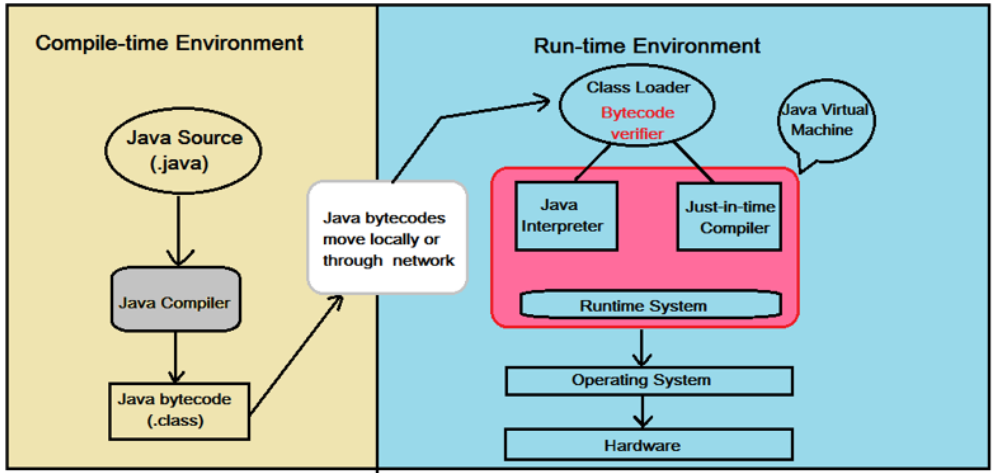
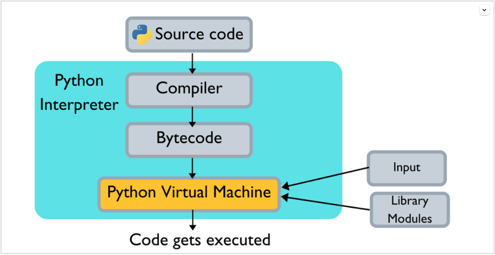

# How code run in different programming languages?

## Compiler vs interpreter

### 1. Compilation

-   Is the translation process from _high-level programming lang_ (C, java, ..) to _lower one_ (byte code, object code, _binary machine code_, ...).
-   It takes the entire program as input at a time
-   The result of compilation process can be runnable by machine hard ware (**binary machine code**) or be used by other interpreter/ compiler (**byte code**)

### 2. Interpretation

-   It translates the source code to _binary machine code_
-   It takes the a line/ block of code as input at a time
-   There are a few strategies of interpreter:
    -   Directly translates _sorce code_ to _binary machine code_
    -   or, translates _source code_ to _byte code_ (by _complier_ - a part of interpreter), then from that to _machine code_
    -   or, translates pre-storedd _byte code_ to _machine code_

## Comparison between different programming language (PL)

When categorizing programming languages into _interpreted_ or _compiled_ one, it depends not only the programming language itself, but also on the environment run it.

https://stackoverflow.com/questions/17253545/scripting-language-vs-programming-language

But we will talk about how it normally run

### 1. C

-   compiled PL
-   compiler translates source code directly to machine binary code, which is runnable by hardware

### 2. Java

https://stackoverflow.com/questions/1326071/is-java-a-compiled-or-an-interpreted-programming-language

-   can be both defined as a compiled and an interpreted language. But the compiled one is more popular
-   Source code first is complied to byte code, then, depends on different Java VM, it is either:

    -   compiled directly to binary machine code (JIT compiler)
    -   or be interpreted (block-by-block)

    JIT compiler is used when there are long-running tasks. But interpreter is used for short-running tasks. Because JIT causes the slowness during initialization

### 3. Python

https://www.c-sharpcorner.com/article/why-learn-python-an-introduction-to-python/
https://towardsdatascience.com/understanding-python-bytecode-e7edaae8734d

-   similar as Java, it is both defined as compiled & interpreted. But it is usually called interpreted PL
-   Source code first is complied to byte code, then, Python VM will interprete this byte code (block-by-block) into binary machine code. There are many variation of Python VM implementation, which can have different performance:
    -   CPython (traditional)
    -   Jython
    -   ...

> **Note**:
> Java & Python both have quite similar way to execute its code. Yet, Java VM is much faster than Python one, thanks to:
>
> -   JIT comiler, which is hard & not suitable to implement in Python - dynamic type PL
> -   Java is static-type PL, which saves lots of time when determining type compared to Python
